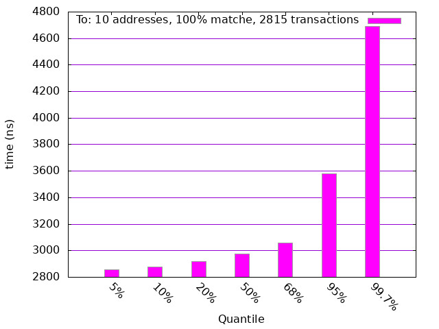

# SearchJS Benchmark

## Benchmarking JavaScript

### Method

Timing is performed using Node.JS with the NanoTimer package.   The data set is BlockNative transaction data in formatted JSON form.   1000 confirmed transactions are included which include 2815 total events.  Filter sets are applied to each event individually and iterated for a minimum of 1000 searches. The total nanoseconds are tallied and the mean is determined.

### Hardware

Timing is performed on '19 i7 MacBook Pro running Docker from a Debian stable-slim base image.

### Caveat 

This is a 'best effort' benchmark.   The goal of this work is to produce a ballpark estimate of search performance for the package (SearchJS)[https://github.com/deitch/searchjs] for simple searches.   No effort has been made to compare wildly different hardware platforms and architectures or to be accurate to the nanosecond.

## Results

### Single Search

Search for a single low cardinality field.  All timings in nanoseconds.

### Single Address Matching

Search for a unique matching, single address field.

### Double Address Matching

Search for two unique matching addresses.  Note the uptick in timing for multiple matching.   

### Multiple Address Matching

Search for ten unique matching individual addresses.   This search is significantly more expensive.

